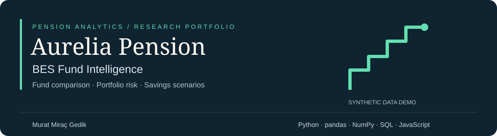
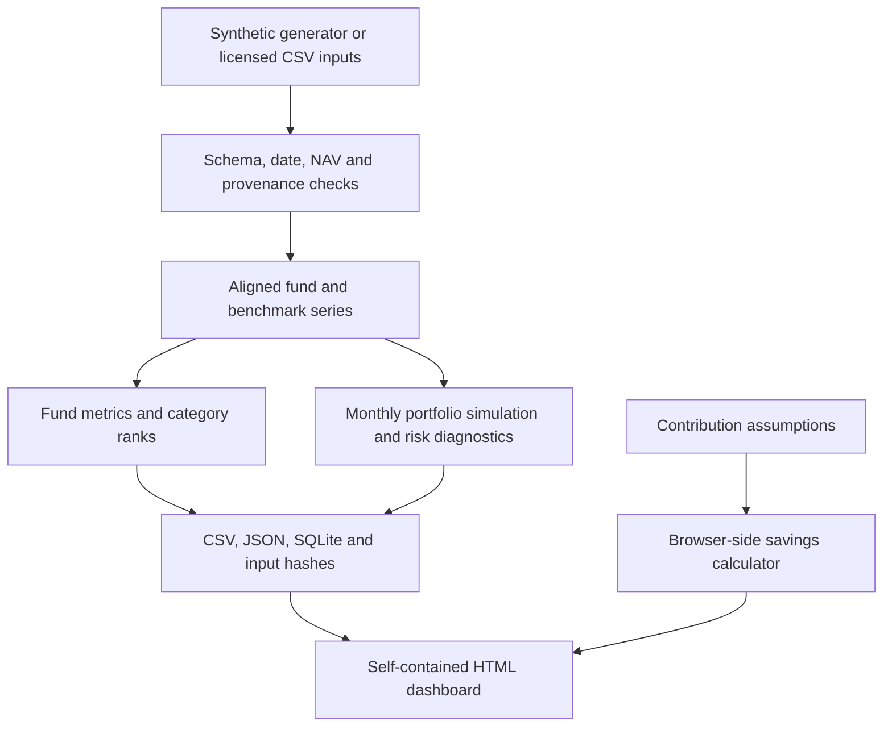

# Aurelia Pension — BES Fund Intelligence

**Pension fund performance, portfolio risk and contribution-scenario analytics.**

By **Murat Miraç Gedik** · Banking & Insurance Analytics · Risk Analytics

[](https://github.com/muratmiracg-dev/aurelia-pension-bes-fund-intelligence/actions/workflows/ci.yml)
[](https://github.com/muratmiracg-dev/aurelia-pension-bes-fund-intelligence/actions/workflows/codeql.yml)
[](LICENSE)

[Türkçe açıklama](README.tr.md) · [Methodology](docs/METHODOLOGY.md) · [Data contract](docs/DATA_CONTRACT.md) · [Validation](docs/VALIDATION.md)

A reproducible analytical product for a fictional Turkish pension research team.
It connects category-relative fund comparison, historical downside risk, monthly
portfolio rebalancing, walk-forward VaR diagnostics and inflation-aware contribution
scenarios in a self-contained, five-screen browser application.

**All included fund identities, prices, benchmarks and outcomes are synthetic.**
The product demonstrates analytical methods. It does not give personal investment
advice, determine suitability or reproduce the official EGM evaluation process.

## At a glance

| Demo universe | Analytical coverage | Engineering evidence |
|---|---|---|
| 30 fictional funds across 5 categories | 1Y, 3Y and full-history comparisons | 32 Python regression tests |
| 36,900 NAV records over 1,230 dates | 3 model portfolios and 4 stress scenarios | 543 Python/JavaScript numerical comparisons |
| 3 Jan 2022–18 Sep 2026 | 5 interactive application screens | 10 ingestion gates, SQL views and source hashes |

**For reviewers:** open the bundled report, follow the five-minute walkthrough below,
then inspect the methodology and test evidence. The strongest portfolio evidence is
the connection between explicit financial assumptions, validated inputs and reproducible outputs.

## Open the application

Use **Code → Download ZIP**, extract the archive, and open
[`artifacts/Aurelia_Pension_BES_Dashboard.html`](artifacts/Aurelia_Pension_BES_Dashboard.html)
in a modern desktop browser. No installation, login, API key, external CDN or network
connection is needed for the bundled report. Some mobile file-preview apps disable
JavaScript; use an actual browser or the local server below.

The report is an interactive application: category, period, fund and model-portfolio
selections update the charts and tables; contribution inputs recalculate immediately;
the current fund comparison can be exported to CSV. It is a generated snapshot, not a
live market feed. GitHub's file viewer shows HTML source; download the file or run
the local server to use the application. This repository does not currently provide a
hosted live demo.

### Five-minute walkthrough

| Screen | Try this | What to inspect |
|---|---|---|
| Genel görünüm | Review the universe and reporting dates | Data classification and comparison coverage |
| Fon karşılaştırma | Select one category, then switch between 1Y and 3Y | Return rank alongside volatility, drawdown and benchmark excess return |
| Portföy & risk | Compare Temkinli, Dengeli and Büyüme | Allocation differences, rebalance costs, stress losses and VaR exceptions |
| Birikim senaryosu | Change contributions and inflation | Nominal wealth versus purchasing power; assumed outcomes, not forecasts |
| Veri & yöntem | Inspect definitions and quality gates | Provenance, assumptions and model boundaries |

Export the selected fund comparison as CSV for further review. Compare funds within
the same category and period; a higher return rank alone is not a suitability decision.

## Business questions

- How does a fund compare with peers of the same category over identical dates?
- Is excess return accompanied by greater volatility or drawdown?
- How do three fixed allocations behave after monthly rebalancing costs?
- How often does a historical VaR estimate fail on subsequent observations?
- How do contribution growth, assumed returns and inflation change retirement savings?

## Implemented scope

| Area | Implementation |
|---|---|
| Universe | 30 fictional funds, 5 categories, 1,230 common NAV dates |
| Period | 3 January 2022–18 September 2026, weekday-only simulated calendar |
| Fund analytics | Period return, annualized return/volatility, max drawdown, tracking error, information ratio |
| Peer comparison | Category-only ranks and median; same start/end observations |
| Downside risk | One-day historical 95% VaR and fractional-tail Expected Shortfall |
| Portfolio | Three predetermined allocations; drifted holdings, monthly rebalance, 5 bps one-way turnover cost |
| Model monitoring | 252-observation historical VaR estimated strictly before each test day |
| Stress | Four transparent hypothetical category shocks at target portfolio weights |
| Savings | Month-start contribution, annual contribution escalation, inflation-adjusted terminal value |
| Warehouse | SQLite fact/dimension tables, reporting views and window-function return query |
| Delivery | Offline HTML application, raw CSVs, derived CSVs, JSON evidence, automated tests |

The first alphabetically ordered fund in each category is selected for the model
portfolios. There is no retrospective performance-based fund selection or claimed
portfolio optimization. The allocations are examples, not participant risk profiles.

## Architecture and data flow



Python computes the historical snapshot. SQL exposes reporting views. The browser
reads the embedded snapshot and recalculates savings scenarios locally. No server-side
account, API key or external database is required for the bundled application.

## Rebuild

Python 3.11 or newer and Node 20+ for JavaScript validation:

```bash
git clone https://github.com/muratmiracg-dev/aurelia-pension-bes-fund-intelligence.git
cd aurelia-pension-bes-fund-intelligence
python -m venv .venv
# Linux/macOS:
source .venv/bin/activate
# Windows PowerShell: .venv\Scripts\Activate.ps1
python -m pip install -e .
python -m aurelia_pension validate
python -m aurelia_pension build
python -m unittest discover -s tests -v
node tests/test_engine.cjs
```

Run commands from the repository root. The generator uses seed `20260920`.
Input hashes are recorded in `artifacts/manifest.json`. To reproduce the original
numerical dependency versions, install `requirements-repro.txt` before the editable
package. CI also tests the dependency ranges declared in `pyproject.toml`.

| Command | Behavior |
|---|---|
| `validate` | Read existing CSVs and check the build contract; write no files |
| `validate --json` | Emit a JSON result; exit 0 for success, 2 for invalid or missing input |
| `build` | Regenerate demo data and analytical artifacts |
| `build --data-dir PATH` | Build from supplied CSVs without rewriting them |
| `serve` | Serve the existing report on localhost; build if absent |
| `serve --data-dir PATH` | Rebuild from the specified CSVs before serving, even if a report exists |

Optional local serving:

```bash
python -m aurelia_pension serve --port 8765
```

Open `http://127.0.0.1:8765/Aurelia_Pension_BES_Dashboard.html`.
The server binds to localhost and is intended only for local review.

## Bring your own licensed data

```bash
python -m aurelia_pension validate --data-dir /absolute/path/to/validated/csvs --json
python -m aurelia_pension build --data-dir /absolute/path/to/validated/csvs
```

Follow the [data contract](docs/DATA_CONTRACT.md) exactly. The external adapter is
file-based; no EGM/TEFAS scraping or API integration is claimed. External sources need
provenance URLs and source cutoff dates. Missing dates fail validation instead of being
silently forward-filled. Use externally supplied data only when you have the necessary
usage rights and have checked the suitability of category and benchmark mappings.

## Explore the warehouse

Open `artifacts/aurelia_pension.sqlite` in a SQLite client or a compatible BI connector.
The database contains fund metadata, fund/benchmark NAV histories, fund-period metrics
and model-portfolio summaries.

```sql
SELECT category, fund_id, peer_rank,
       ROUND(100 * total_return, 2) AS return_pct,
       ROUND(100 * max_drawdown, 2) AS max_drawdown_pct
FROM vw_peer_performance
WHERE period = '1Y' AND peer_rank = 1
ORDER BY category, fund_id;
```

[Executable SQL examples](sql/example_queries.sql) also compare portfolio risk and
reconcile observation counts. With the SQLite command-line client installed:

```bash
sqlite3 -header -column artifacts/aurelia_pension.sqlite < sql/example_queries.sql
```

### Reading the metrics

| Metric | Interpretation and convention |
|---|---|
| Annual return | Geometric annualization using 252 return observations per year |
| Volatility | Sample daily standard deviation, annualized with √252 |
| Maximum drawdown | Worst peak-to-trough return; zero or negative |
| VaR / Expected Shortfall | Historical one-day 95% loss measures; positive loss values, floored at zero |
| Excess return | Fund cumulative return minus its category benchmark cumulative return |
| Peer rank | Descending return rank within a category; ties retain the same minimum rank |
| VaR exception rate | Share of subsequent days exceeding the preceding-window VaR; diagnostic, not a pass/fail label |

CSV and database ratios use decimal units: `0.12` means 12%. Full definitions,
rebalance timing and cost assumptions are in [Methodology](docs/METHODOLOGY.md).

## Repository map

```text
src/aurelia_pension/  Financial calculations, data contracts and deterministic build
web/                 Application template and independently testable JS engine
data/demo/           Synthetic fund metadata, NAVs and benchmark observations
artifacts/           Working report, SQLite, metrics, quality checks and hashes
sql/                 Analytical views
tests/               Financial invariants, data controls, Python/JS reconciliation
docs/                Methodology, source register, data dictionary and validation
.github/             CI, CodeQL and dependency-update configuration
```

## Evidence and boundaries

The local Python suite has 32 passing tests, including input-validation and CLI regressions. Browser-side calculations reconcile with
Python across 543 numerical comparisons plus boundary checks. These tests verify
specific calculations, not real-world predictive performance. Interactive visual/browser
QA was blocked by the execution environment's local-file navigation policy; see the
remaining manual acceptance checklist in `docs/VALIDATION.md`.

The following are explicitly excluded: statutory state-contribution entitlement,
vesting, withholding tax, contract-specific deductions, personal suitability, automated
fund switches and official regulatory reporting. The assumed fund NAV already reflects
fund expenses; do not deduct the model fee again.

EGM's official performance evaluation uses gross-return rules and peer-group thresholds.
This product uses descriptive NAV-return ranks. [Official method](https://www.egm.org.tr/fonlar/fon-performans-degerlendirme-sistemi/fon-performans-degerlendirme-yontemi/).

## Troubleshooting

| Symptom | Resolution |
|---|---|
| GitHub displays HTML code | Download and extract the repository; open the local HTML in a browser |
| Mobile preview is blank or inert | Use a desktop browser or the localhost server; some file previews disable JavaScript |
| CSV validation fails | Read the specific error and check the [data contract](docs/DATA_CONTRACT.md); missing observations are not filled automatically |
| A supplied dataset does not appear | Use `serve --data-dir PATH` to rebuild before serving, or explicitly run `build --data-dir PATH` |
| Port 8765 is already in use | Run `python -m aurelia_pension serve --port 8766` |

## Development

Run the Python suite and JavaScript reconciliation after analytical changes. Tests cover
known-answer calculations and timing invariants; the new CLI tests also verify that
validation leaves inputs untouched and invalid explicit data cannot silently serve an
old snapshot. See [validation evidence](docs/VALIDATION.md) and [change notes](CHANGELOG.md).

For bug reports, include the command, error, Python version and a minimal synthetic
reproduction. Do not attach licensed or personal data. See [SECURITY.md](SECURITY.md)
for security reporting guidance.

## License

Code and generated synthetic fixtures: [MIT](LICENSE). Third-party data retains its own
rights; the source register is methodological context, not a redistribution license.
